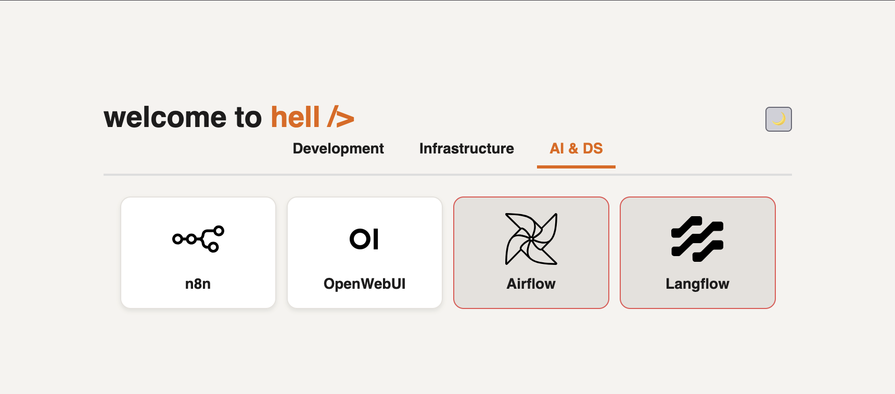
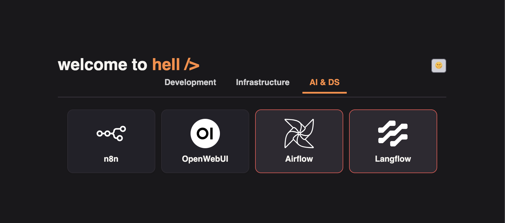

# Lan-ding: hub page for local infrastructure

**Stack:** 
Vue 3 + Pinia, Vite.

**Purpose:** a single start page with quick links to services in your internal network. Supports categories, availability indicator, and light/dark theme.




## Features

* Link categories (generated automatically from the `category` field).
* Service availability indicator (periodic `fetch` with a 500 ms timeout; if the request fails/CORS blocks it, the service is marked unavailable).
* Theme toggle (choice stored in `localStorage`).
* Minimal dependencies, static artifact in `dist/`.

Availability indicator limitations:

* The check runs in the user’s browser. If the target service doesn’t return CORS headers, the result can be a **false negative**. It’s recommended to enable `Access-Control-Allow-Origin: *` on status/health pages or proxy the checks via the same domain that serves the landing.

## Quick start (local)

```bash
# Requires Node.js 22+
npm ci
npm run dev      # dev server on 0.0.0.0
```

Preview the production build:

```bash
npm run build
npm run preview
```

## Link configuration

All links are defined in `src/stores/links.js`:

```js
// Example
{ 
  url: 'https://gitea.example.lan',
  name: 'Gitea',
  icon: '/icons/gitea.svg',     // place the file under public/icons/
  category: 'Development',      // arbitrary string; categories are built automatically
  available: true               // initial state; updated automatically later
}
```

Recommendations:

* Keep category names consistent (e.g., `Development`, `Infrastructure`, `AI & DS`, `Office`).
* Put icons under `public/icons/` and use SVG.
* If you have many links, split them by categories; ordering follows the array order in the same file.

---

## Build & deploy

Build:

```bash
npm run build   # output in dist/
```

Typical deploy: rsync/scp the `dist/` contents to a web host, e.g., `/var/www/lan`.

Nginx (example):

```nginx
server {
  listen 80;
  server_name lan.example.lan;
  root /var/www/lan;
  index index.html;
  location / {
    try_files $uri /index.html;
  }
}
```

> If the page is served under a subpath (`/landing/`), set `base` in `vite.config.js`:
>
> ```js
> export default defineConfig({ base: '/landing/' /* … */ })
> ```

---

## CI/CD (one workflow for Gitea and GitHub Actions)

The `build-and-deploy` workflow works for **both providers**. 

SonarQube and Deploy steps run **only if the secrets are set**.

On GitHub — don’t create the secrets -> steps are skipped.
On local Gitea — create the secrets -> steps run.

See `.github/workflows/build-and-deploy.yml` for the details.`

Alternative with an explicit provider switch: create a Gitea **Repository Variable** `CI_TARGET=gitea` and use `if: ${{ vars.CI_TARGET == 'gitea' }}` for Sonar/Deploy.


## Tests & coverage

The project uses Vitest:

```bash
npm run test:unit
npm run coverage
```

## License

Unlicense. Do whatever you want.
